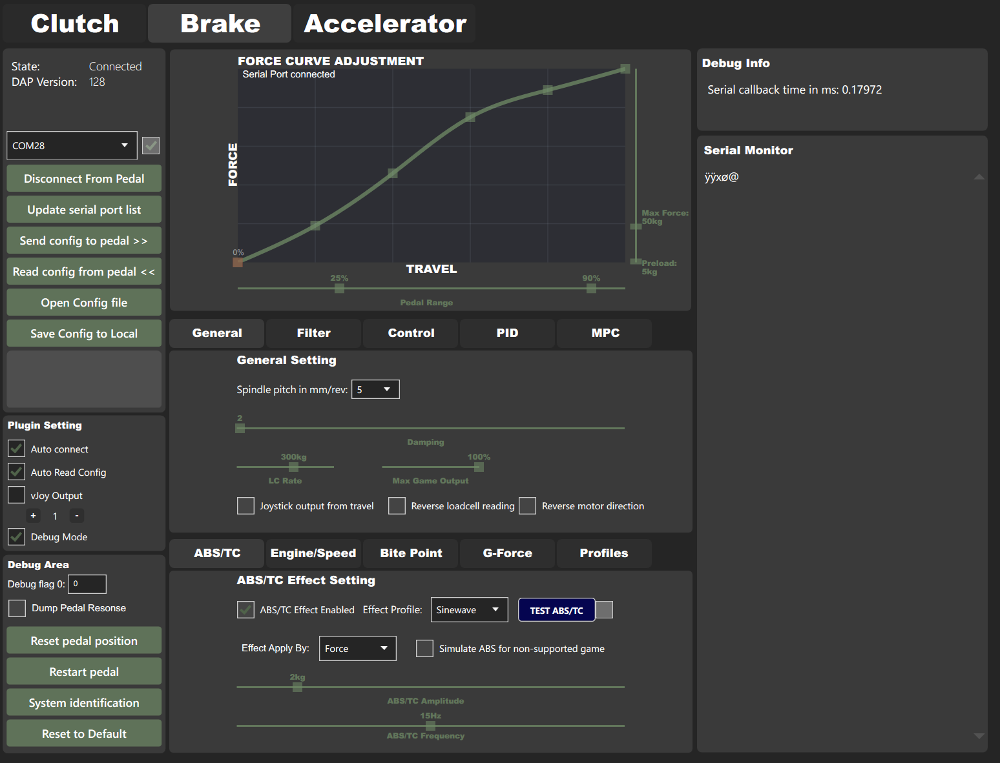

[](https://github.com/ChrGri/DIY-Sim-Racing-FFB-Pedal/actions/workflows/arduino.yml)
[](https://github.com/ChrGri/DIY-Sim-Racing-FFB-Pedal/actions/workflows/main.yml)

# DIY-Sim-Racing-FFB-Pedal

# Disclaimer
This repository documents my research progress. I wanted to understand the necessary signal processing and control theory algorithms behind such a device. 

The FFB pedal is a robot and can be dangerous. Please watch [The Terminator](https://en.wikipedia.org/wiki/The_Terminator) before continuing. If not interacted with care, it may cause harm. I'm not responsible for any harm caused by this design suggestion. Use responsibly and at your own risk.

# License
Shield: [![CC BY-NC-SA 4.0][cc-by-nc-sa-shield]][cc-by-nc-sa]

This work is licensed under a
[Creative Commons Attribution-NonCommercial-ShareAlike 4.0 International License][cc-by-nc-sa].

[![CC BY-NC-SA 4.0][cc-by-nc-sa-image]][cc-by-nc-sa]

[cc-by-nc-sa]: http://creativecommons.org/licenses/by-nc-sa/4.0/
[cc-by-nc-sa-image]: https://licensebuttons.net/l/by-nc-sa/4.0/88x31.png
[cc-by-nc-sa-shield]: https://img.shields.io/badge/License-CC%20BY--NC--SA%204.0-lightgrey.svg

# Features
## Control of pedal parameters
To tune the pedal parameters, a SimHub plugin was developed, which communicates with the pedal over USB.

## Effects
Currently ABS, TC and RPM vibration are supported effects. The SimHub plugin communicates with the pedal and triggers game effects as parameterized.

## Servo tuning
The used microcontroller has software to communicate with the used iSV57 servo. Therefore, it can tune the servos PID loop and read certain servo states like position, torque, power. 

## Joystick data stream
The joystick/gamepad data is provided via three redundant channels
1) Bluetooth
2) 0V-3.3V output analog signal. Can be read by e.g. https://gp2040-ce.info/. The pin 25 was used for analog output.
3) vJoy gamecontroller (only available when SimHub runs, also need enable control map plugin).

## Pedals in action
[](https://www.youtube.com/watch?v=i2e1ukc1ylA)


# Contributions
A lot of awesome devs have helped this project grow. Just to name a few:

- [tjfenwick](https://github.com/tjfenwick) started the project with an initial implementation.
- [tcfshcrw](https://github.com/tcfshcrw) helped to elevate the Simhub plugin to its current form, added a ton of pedal effects, hardware and discord support, good guy and much more.
- [MichaelJFr](https://github.com/MichaelJFr) helped with refactoring the code at the beginning of this project. Fruitful discussions let to the implementation of the control-loop strategies.
- [Ibakha](https://github.com/Ibakha) Discord channel CEO.


# Discord
A [Discord](https://discord.gg/j8QhD5hCv7) server has been created to allow joint research.


# Hardware
## Electronics

## Control PCB
The embedded code of this DIY FFB pedal runs on an ESP32 microcontroller. The PCB design was developed to prove the concept. It holds the ESP32, the ADC, a level shifter, and connectors. Currently, version 3 of this PCB design is used which introduced sensorless homing of the servo. The PCB design and pinout diagram can be found [here](Wiring/Esp32_V3). If you use Simucube wheelbase, you can use the D15 accessory port for input, detail was list [here](Wiring/PCB_analog_output)

Here is an image of the plain PCB:


Here is an image of the assembled PCB:


### Wiring
The PCB has three connectors with the following wiring:

#### Servo motion port
| Connector at PCB           |  Servo |
:------------------------- | :-------------------------
| Dir-| Dir-|
| Dir+| Dir+|
| Pul-| Pul-|
| Pul+| Pul+|

#### Servo debug port 
| Connector at PCB           |  Servo |
:------------------------- | :-------------------------
| Gnd| Gnd|
| Tx| Rx|
| Rx| Tx|

#### Loadcell port 
| Connector at PCB           |  Loadcell |
:------------------------- | :-------------------------
| 5V| V+|
| Gnd| V-|
| Gnd| Shield|
| S+| S+|
| S-| S-|

#### Servo power port 
It is recommended to use a Schottky diode in the positive line from the PSU to the servo. The plated side faces the servo.
| PSU           |  Servo |
:------------------------- | :-------------------------
| 36V/48V| Vdd+|
| Gnd| Gnd|


## Power PCB
Depending on the load direction, the servo will act as a generator. It will produce an additional current flow from the servo to the PSU which could trigger the over-voltage protection from the PSU and the servo. To prevent the reverse current flow to the PSU and thus prevent over-voltage protection from the PSU, a Schottky diode was added to the power line. To prevent the trigger of the over-voltage protection from the servo a large capacitor was added in the power-line.

| Component           |  Link |
:------------------------- | :-------------------------
| SR5100 Schottky diode | [Amazon.de](https://www.amazon.de/Packung-20-SR5100-Schottky-Barriere-Gleichrichterdioden-DO-201AD/dp/B079KK7QL5/ref=sr_1_3?keywords=sr+5100+diode&qid=1691820234&sr=8-3) |
| 100V 10kF capacitor| [Amazon.de](https://www.amazon.de/dp/B07QWTMKWZ?ref_=cm_sw_r_apan_dp_ANE55Z4BEQEJHQBQSDVM&language=de-DE) |

To hold the components, a [power PCB](https://github.com/ChrGri/DIY-Sim-Racing-FFB-Pedal/tree/main/Wiring/PowerPcb) was developed, which also featured a port to hold XT30 connectors. The 

Here is an image of the plain PCB:


Here is an image of the assembled PCB:


A graph of the voltage fluctuations introduced by generative current flow from the servo can be seen here:


Without the capacitor these fluctuations would be much higher eventually triggering the servos overvoltage protection.


## Mechanical design
Here are some examples of mechanical designs awesome DIYers have done: 

| Design           |  Link |
:------------------------- | :-------------------------
|  |  [Tjfenwick's design](https://github.com/tjfenwick/DIY-Sim-Racing-Active-Pedal)|
|  |  [Bjoes design](https://github.com/Bjoes/DIY-Active-pedal-mechanical-design)|
|  |  [GWiz's design](https://www.printables.com/de/model/557527-simucube-style-active-pedal/files)|
|  | [shf90's design](https://www.thingiverse.com/thing:6414587)|


## BOM
The [BOM](Design/BOM.md) refers to the pedal design which I have chosen, see [here](Design/MechanicalDesign.md).

# Software

## ESP32 code

### Architecture
A Doxygen report of the sources can be found [here](https://chrgri.github.io/DIY-Sim-Racing-FFB-Pedal/Arduino/html/index.html).

### Install ESP32 driver
The drivers can be found here [here](https://www.silabs.com/developers/usb-to-uart-bridge-vcp-drivers).

### Firmware generation and flashing
Firmware can be built and flashed via Arduino-IDE or Arduino-CLI.

#### Built from source (via Arduino-IDE)
1. Install the ESP32 dependencies in Arduino-IDE, see e.g. [here](https://randomnerdtutorials.com/installing-the-esp32-board-in-arduino-ide-windows-instructions/)
2. Install the [libraries](https://github.com/ChrGri/DIY-Sim-Racing-FFB-Pedal/tree/main/Arduino/libs)
3. Flash the [code](Arduino/Esp32/Main), e.g. via Ardiuno-IDE to esp32.

#### Built from source (via Arduino-CLI)
1. Install the [Arduino CLI](https://github.com/arduino/arduino-cli/releases)
2. Install the libraries `git submodule update --init --recursive`
3. Execute the [build script](Arduino/Esp32/arduinoCliBuildScript.bat) from a local repo.
4. Flash the binaries via e.g. web installer, see [below](#flash-prebuilt-binaries-via-webflasher).

#### Flash prebuilt binaries via web flasher
The binaries are available [here](https://github.com/ChrGri/DIY-Sim-Racing-FFB-Pedal/releases). They can be flashed via the ESP [webflasher](https://esp.huhn.me/). 

Memory address            |  File
:-------------------------:|:-------------------------:
| 0x1000 | Main.ino.bootloader.bin |
| 0x8000 | Main.ino.partitions.bin | 
| 0xe000 | boot_app0.bin |
| 0x10000 | Main.ino.bin |


## iSV57T-130 servo config tuning
The iSV57T allows parameter tuning via its RS232 interface. To tune the servo towards this application, I executed the following [steps](StepperParameterization/StepperTuning.md).

With the current [PCB](Wiring/Esp32_V3) design, the ESP can directly communicate with the iSV57T servo. Manual tuning as described before isn't necessary anymore. A description of the steps I undertook to decode the communication protocol can be found on the Disord server. Additional features such as sensorless homing and lost-step recovery were developed and integrated with the help of this communication.

## SimHub plugin:
The SimHub plugin was designed to communicate with the ESP to (a) modify the pedal configuration, e.g. the force vs. travel parameterization and (b) to trigger effects such as ABS oscillations.  



To install the plugin, the plugin [DiyActivePedal.dll](https://github.com/ChrGri/DIY-Sim-Racing-FFB-Pedal/releases) has to be copied to the SimHub directory, e.g. C:/Program Files (x86)/SimHub

# Steps after flashing the firmware
The pedal will not move initially after flashing. One has to open the SimHub plugin, connect to the pedal, and send a config with non-zero PID values.
Recommended PID values are:

```
P=0.2-0.4
I=50-150
D=0
```

After sending the initial config, power cycling of the pedal is necessary. The pedal should move afterward.


# Error handling
## Pedal doesn't move after initial setup
1. Make sure, that you follow the above instructions. The default PID values are set to 0 thus the pedal will not move. You have to send non-zero PID values and restart the pedal to observe pedal travel.
2. Open the serial monitor in Arduino IDE, set the baud rate to 921600, and restart the pedal. You should see some debug info. Make a screenshot and kindly ask the Discord server for help.

## Bluetooth doesn't show gamepad data
Install DirectX 9

## The serial monitor shows a message "Couldn't load config from EPROM due to version mismatch"
Install a SimHub plugin matching the ESP firmware you installed and send a config to the pedal.

## The com port showed access denied or can not connect
Check the arduino plugin scan setting, please use scan only specfiec port as below.<br>


# Misc
## Pedal kinematics calculation
To get a better understanding of the motion and forces, a [python](Validation/PedalKinematics/main.py) script for simulation of the pedal angle, the pedal angular velocity and maximum pedal force has been written. Feel free to tune the pedal geometry as needed. The simulation result for my pedal geometry looks as follows:


# Todo

ESP code:
- [ ] Add automatic system identification of pedal response
- [ ] Add model-predictive-control to the ESP code for the improved pedal response
- [ ] Add field to invert motor and losdcell direction
- [x] send joystick data to simhub plugin and provide data as vJoy gamecontroller
- [x] allow effects to move stepper beyond configured max/min position, but not the measured homing positions
- [ ] Optimize iSV57 communication
  - [ ] Let the communication task run from the beginning of the setup routine
  - [ ] Read pedal state every cycle (currently, the pedal performance is degraded)

      
SimHub plugin:
- [ ] Send SimHub data via wifi to ESP 
- [x] GUI design improvements for the SimHub plugin 
- [x] JSON deserialization make compatible with older revisions
- [ ] include the types header file and use it
- [ ] Make use of effects from the ShakeIt plugin
- [ ] add OTA update for esp firmware
- [x] automatic serial monitor update
- [ ] serial plotter
- [x] add different abs effect patterns, e.g. sawtooth
- [x] make effects proportional to force or travel selectable by dropdown menu
      
Misc:
- [ ] Create a video describing the build progress and the features
- [ ] Add Doxygen + Graphviz to the project to automatically generate documentation, architectural design overview, etc.
